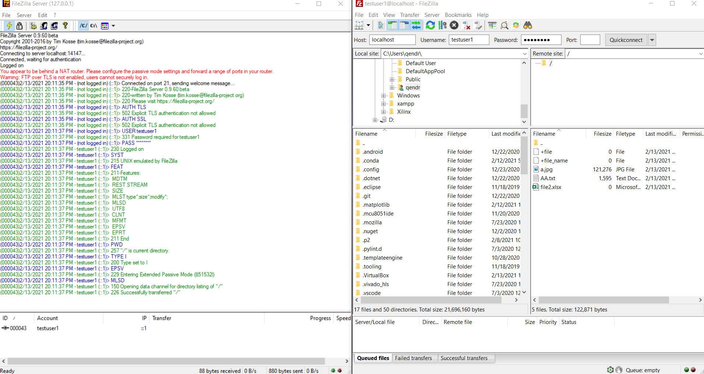
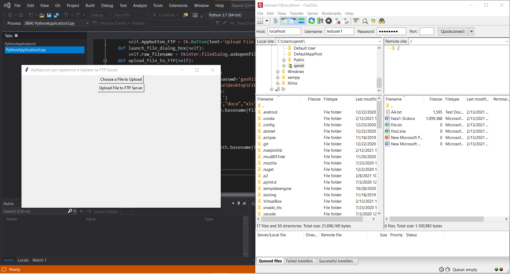
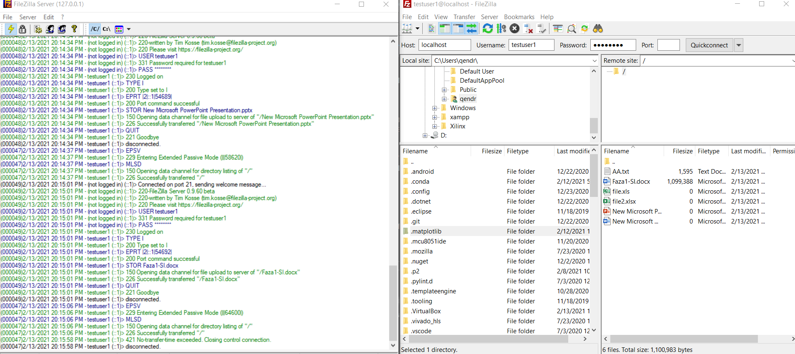

Detyra e dhene ka qene kjo:

Zhvillimi i aplikacionit qe mundeson qe fajllat me ekstension .doc, .docx, .xls, .xlsx ne nje folder te caktuar te ngarkohen ne nje FTP server te caktuar.
Ky aplikacion eshte duhet te jete punuar ne menyre qe te permbaje nje meny per perzgjedhjen e opcioneve/funksionaliteteve te veta. Menyja duhet te jete e punuar si GUI (graphical user interface) duke perdorur vetem modulin tkinter te Python.

Ne permes te kodit tone kemi mundesuar transferimin e fajllave me ekstension .doc, .docx, .xls, .xlsx prej nje folderi ne nje FTP server . Ne rastin tone ne kemi krijuar nje FTP server host tonin permes te cilit kemi mundesuar transferimin/ngarkimin e fajllave te caktuar.

Kodit tone mund te e gjeni ne kete path te repositorit tone (FtpTransfer/FtpTransfer/FtpTransfer.py)

Disa foto qe tregojn ekzekutimin e kodit dhe funksionimin e kodit tone:

Si fillim ne figuren e meposhtme kemi konfigurimin e serverit tone FTP

Pastaj kemi paraqitur se si duket kodi pas ekzekutimit ku na mundeson te zgjedhim file qe do te ngarkojm ne FTP serverin dhe pastaj permes "Upload File To Ftp Server" behet ngarkimi i fajllave te zgjedhur dhe pamja e atyre fajllave ne ftp serverin.

Dhe ne fund eshte konfirmimi i transferimit te fajllave i paraqitur ne figuren e meposhtme.

Kjo ishte nje permbledhje e shkurter e projektit tone dhe ekzekutimit te ketij projekti.
